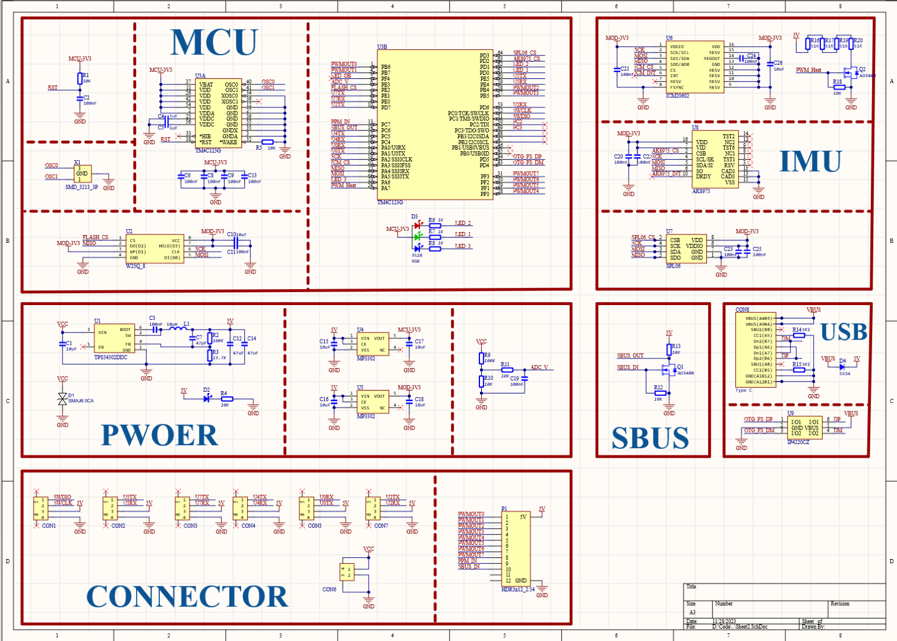
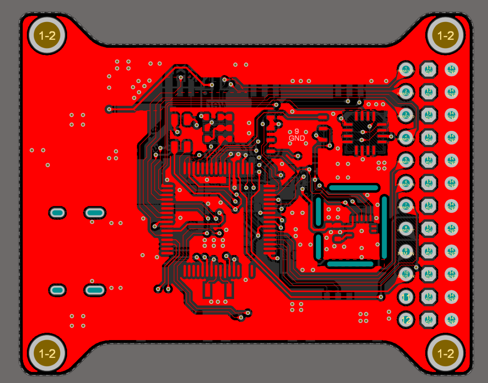
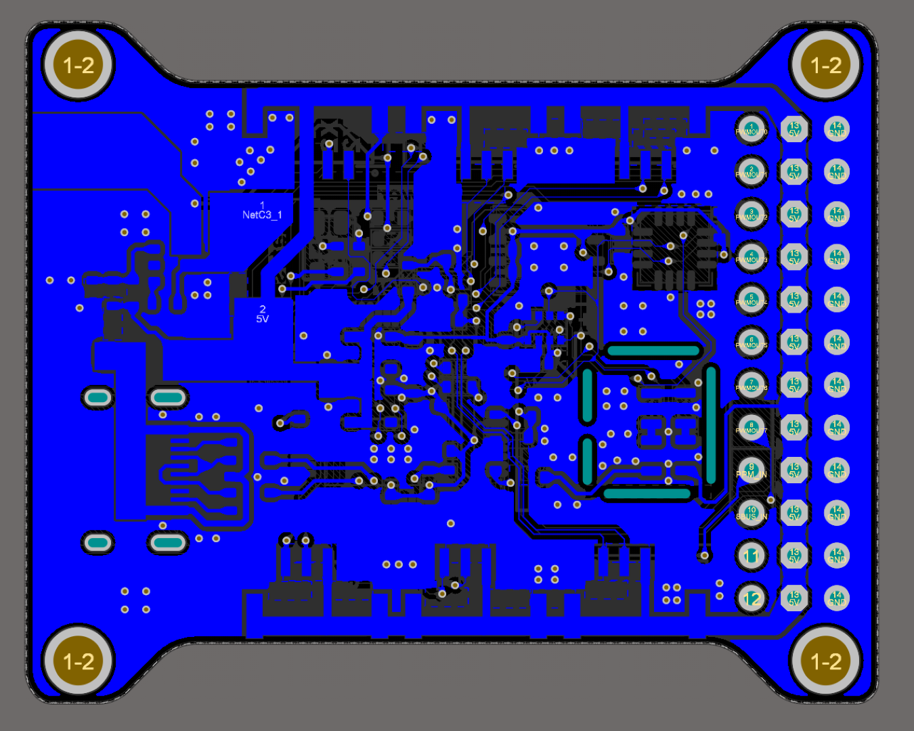
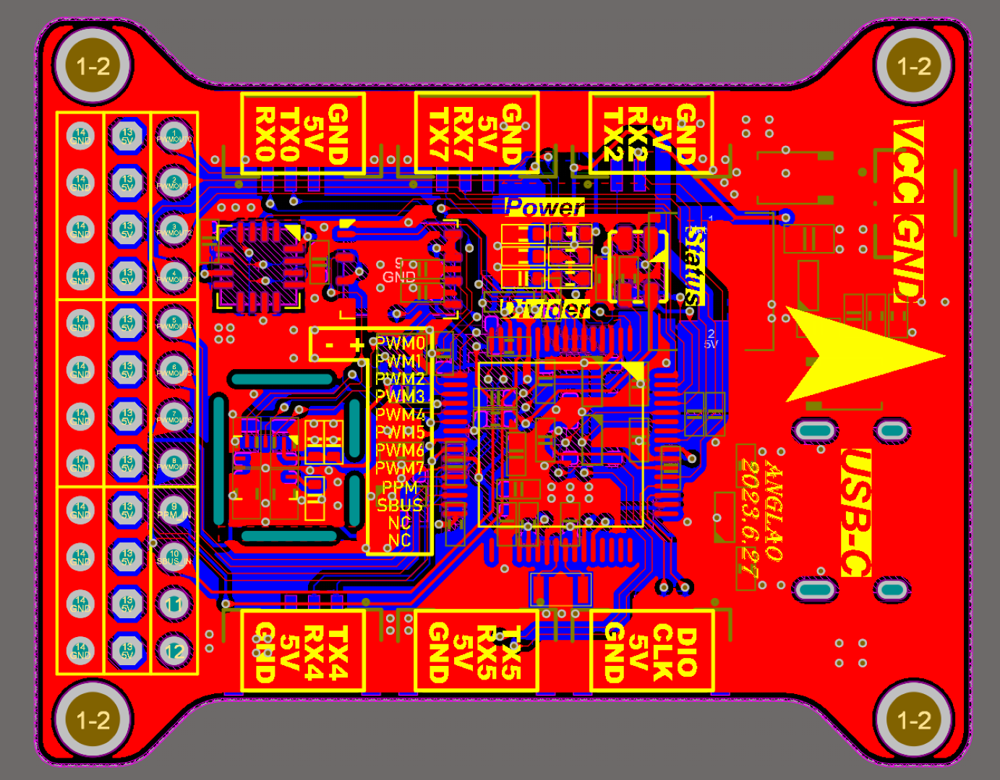
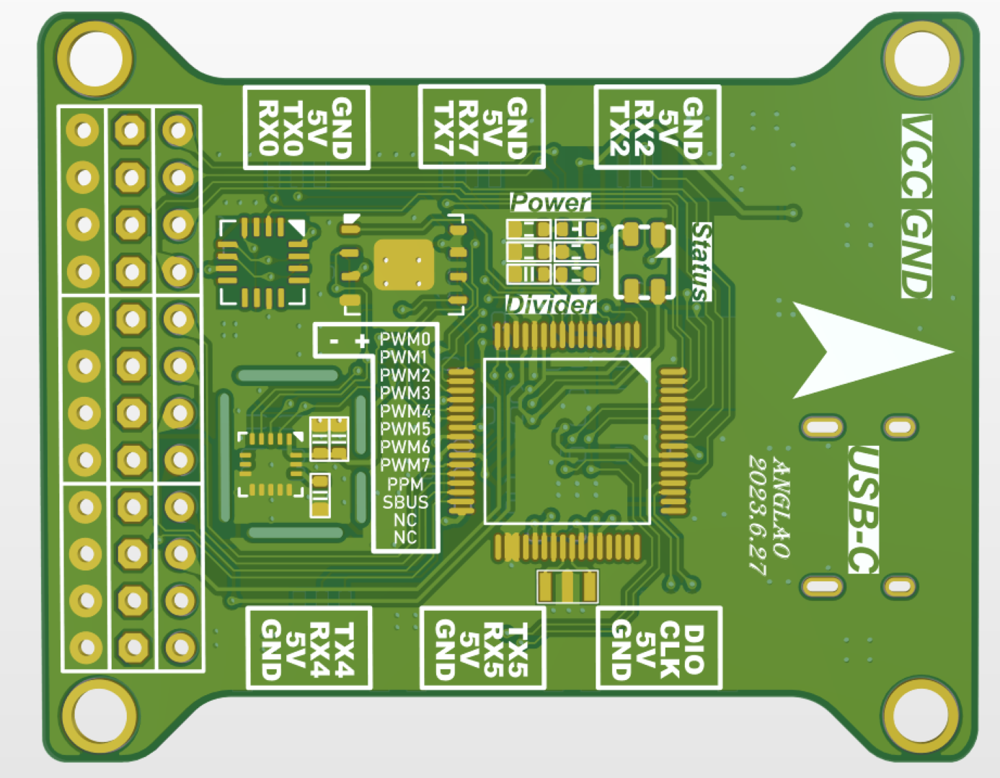
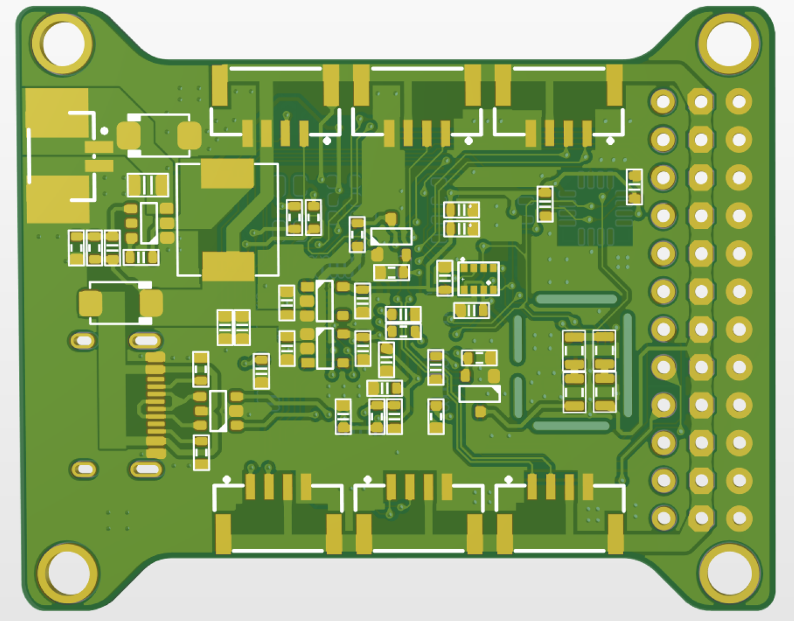
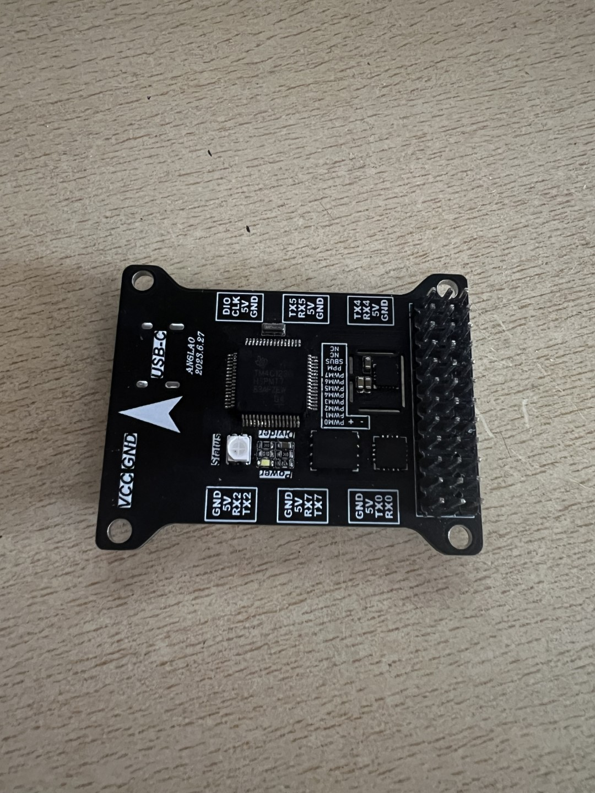
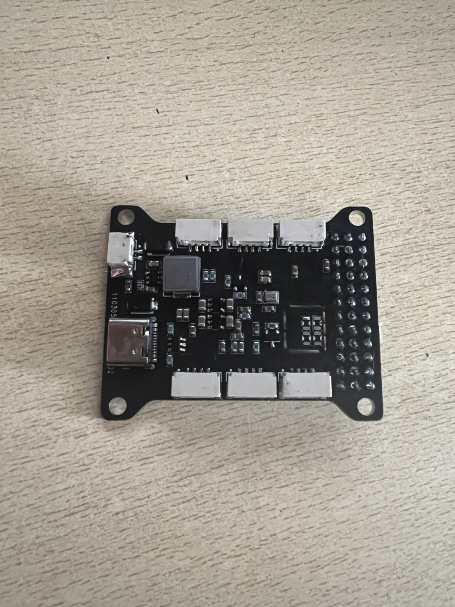

# 硬件参数

| 控制芯片        | 型号   |
| :--------   | :-----  |
| 主控      | TM4C123GH6PM   |
| 加速度计        | ICM20602   |
| 陀螺仪        |    ICM20602    |
| 气压计        |    SPL06    |
| 磁力计        |    AK8975    |
| 闪存        |    W25Q64    |

| 电源管理        | 型号   |
| :--------   | :-----  |
| DC-DC降压        |    TPS54302DDCR    |
| LDO     |    MP3302    |

输入电压:2S~6S

# 硬件设计图例

## 原理图

## 线路图

## 3D图

## 实物图

